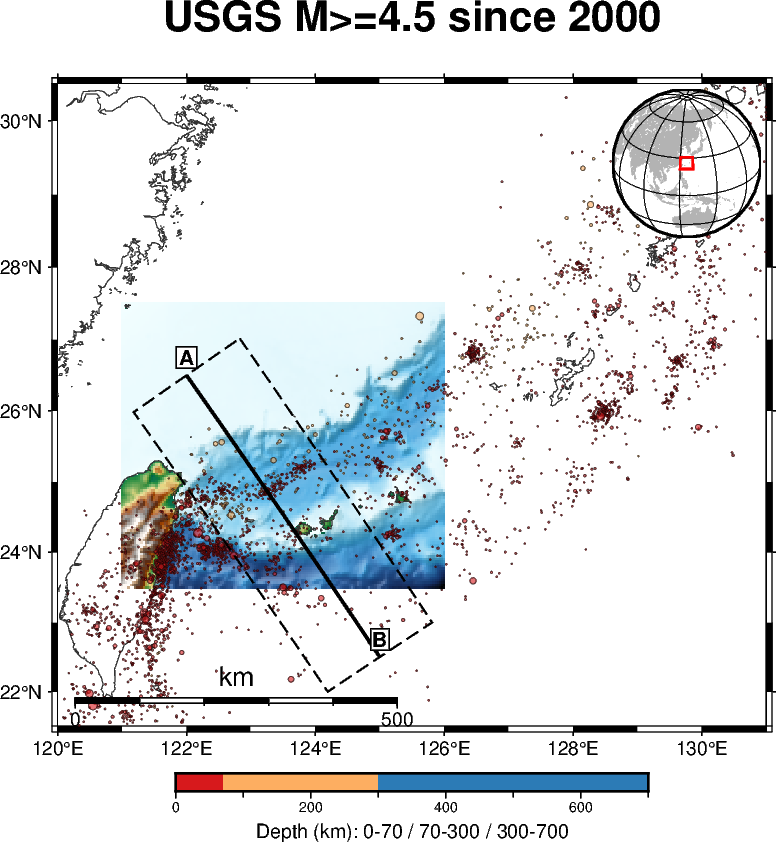
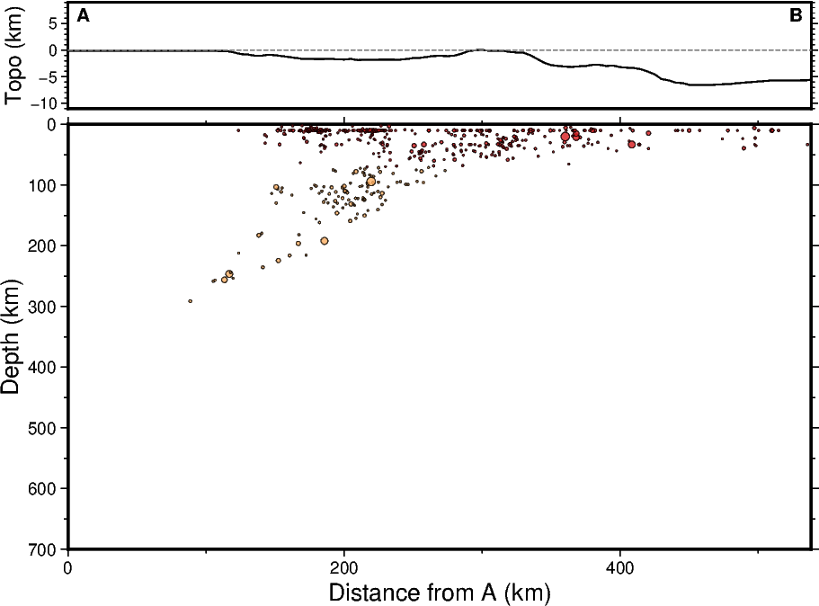

# 🌍 琉球隱沒帶與板塊邊界構造地震學分析

本專案利用 PyGMT 與 USGS 觀測數據，探討台灣東北部、琉球群島一帶的隱沒帶三維幾何構造、火山弧關係及應力場特徵。

---

## 🖼️ Preview (成果預覽)

### 1. 震源分佈與觀測區域地圖
本圖展示了研究區域（$M \ge 4.5$）的地震震源深度空間分佈。左上角已標記資料來源（USGS）、時間範圍、走廊半寬及預設深度地震佔比。

### 2. A-B 地震剖面與地形起伏
下方剖面圖（Wadati-Benioff 帶）呈現出板塊由西北向東南方向隱沒的立體幾何。您可以清楚觀察到因 USGS 人為定位限制所產生的「預設深度（10 / 33 km）」水平密集條帶。

### 3. 全球火山與熱點分布（對比圖）
展示了日本島弧（隱沒帶火山）與夏威夷（板塊內熱點）在板塊構造意義上的根本差異。

---

## 💻 Code (程式碼與執行)

### 1. 核心 Jupyter Notebook
所有的資料獲取、計算及繪圖邏輯均封裝於以下 Jupyter Notebook 中。您可以直接在 GitHub 上閱讀，或使用下方按鈕一鍵於 Google Colab 執行：

* **主程式檔案**：[`Plate_Tectonics_Annotation.ipynb`](./Plate_Tectonics_Annotation.ipynb)
* **Colab 執行連結**： 
  

### 2. 環境與相依套件
本專案使用以下 Python 環境配置，可在 Conda 或 Google Colab 中執行：
- **PyGMT** `v0.17.x`
- **Pandas & NumPy**
- **GMT** `v6.5.x`
💡 實用小技巧：使用「摺疊選單」美化頁面
如果您希望頁面看起來更整潔，還可以利用 HTML 的 
 標籤，把「程式碼細節」或「長篇說明」隱藏起來，讓讀者點擊展開：

🔍 點擊展開：看詳細的板塊邊界解釋與學術說明

### 1. 隱沒帶幾何學特徵
從剖面圖中，深震（藍色）的分佈明顯傾斜，這即是典型的 Wadati-Benioff 帶...

### 2. 人為定位假象
本研究走廊內有 40.5% 的地震被定位在預設的 10km/33km，在解讀地質意義時需特別注意此點。

